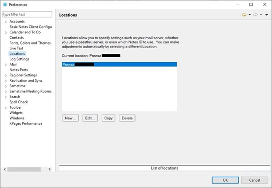
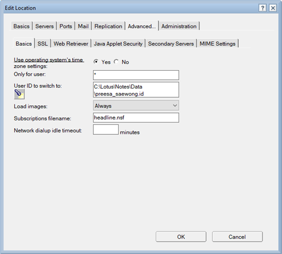

# How to Locate Lotus Notes ID File

1.	Click [File].
2.	Click [Preferences].
3.	Click [Locations].  
4.	Select the location name.
5.	Click [Edit].
6.	Click [Advanced] tab.
7.	You can find the ID file (.id file) path next to “User ID to switch to” (usually at C:\Lotus\Notes\Data).  
