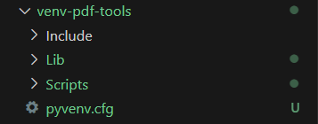
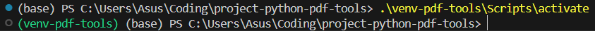

# How to Install a Virtual Environment Using Venv

Virtualenv is a tool to set up your Python environments. Since Python 3.3, a subset of it has been integrated into the standard library under the venv module. You can install venv to your host Python by running this command in your terminal:

```powershell
pip install virtualenv
```

To use venv in your project, in your terminal, create a new project folder, cd to the project folder in your terminal, and run the following command:

```powershell
python -m venv <virtual-environment-name>
```

When you check the new "projectA" folder, you will notice that a new folder called <virtual-environment-name> has been created. <virtual-environment-name> is the name of our virtual environment, but it can be named anything you want.

If we check the contents of <virtual-environment-name> for a bit, on a Windows, you will see a "Scripts" folder. You will also see scripts that are typically used to control your virtual environment, such as activate and pip to install libraries, and the Python interpreter for the Python version you installed, and so on. 

The "Lib" folder will contain a list of libraries that you have installed. If you take a look at it, you will see a list of the libraries that come by default with the virtual environment.



# How to Activate the Virtual Environment

Now that you have created the virtual environment, you will need to activate it before you can use it in your project. On a Windows, to activate your virtual environment, run the code below:

```powershell
.\<virtual-environment-name>\Scripts\activate
```

This will activate your virtual environment. Immediately, you will notice that your terminal path includes env, signifying an activated virtual environment.



# How to Check if the Virtual Environment is Working

First, we check the list of packages installed in our virtual environment by running the code below in the activated virtual environment. You will notice only two packages – pip and setuptools, which are the base packages that come default with a new virtual environment

```powershell
pip list
```

Next, you can run the same code above in a new terminal in which you haven't activated the virtual environment. You will notice a lot more libraries in your host Python that you may have installed in the past. These libraries are not part of your Python virtual environment until you install them.
